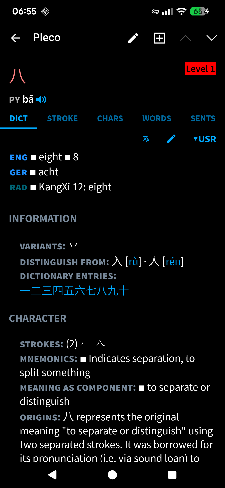
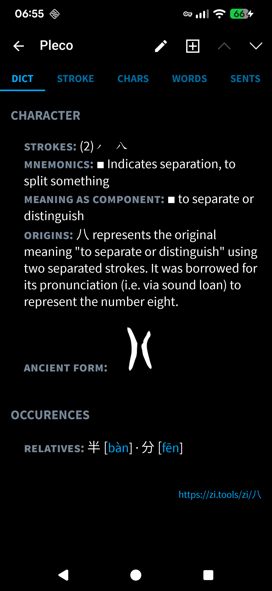

<!--
This README describes the package. If you publish this package to pub.dev,
this README's contents appear on the landing page for your package.

For information about how to write a good package README, see the guide for
[writing package pages](https://dart.dev/tools/pub/writing-package-pages).

For general information about developing packages, see the Dart guide for
[creating packages](https://dart.dev/guides/libraries/create-packages)
and the Flutter guide for
[developing packages and plugins](https://flutter.dev/to/develop-packages).
-->


[](https://pub.dev/packages/suhan_lexicon)
[](https://pub.dev/packages/suhan_lexicon/score)
[](https://github.com/SelinaErnst/lexicon/actions/workflows/dart_test.yml)
[](https://codecov.io/gh/SelinaErnst/Lexicon)
[](https://github.com/SelinaErnst/Lexicon/blob/main/LICENSE)


# Lexicon

Lexicon is a Dart package for working with structured language and dictionary data.

The package is centered around **`Character`** and **`Dictionary`**, providing structures and utilities for representing, organizing, and processing language-related information.

It also provides text-processing functionality, with a particular focus on **Chinese language data, Pinyin, and preparing data for Pleco**.

## Getting Started

Import Lexicon into your Dart project:

```dart
import 'package:suhan_lexicon/suhan_lexicon.dart';
```


## Main Features

* **Character data** — represent and work with individual language entries and their associated information.
* **Dictionary data** — organize and manage collections of characters.
* **Text processing** — modify and normalize strings, lists, and maps containing text.
* **Pinyin processing** — convert between plain, numeric, and tone-marked Pinyin.
* **Pleco-compatible formatting** — apply the formatting required for Pleco-compatible output.

## Character and Dictionary

`Character` and `Dictionary` are the central components of Lexicon. They can be configured for specific languages and their respective data structures. For example, `ChCharacter` and `ChDictionary` provide the corresponding implementations for Chinese language data.

### Character

A `Character` represents an individual language entry together with its associated structured data. Its `categories` define what kinds of information the character can contain and can specify the expected type and structure of that information. Categories therefore provide the framework that gives the data within a character its meaning and structure. Its `baseCategories` define the categories that are fundamental to that character.They contain `String` values and provide the basis for identifying and comparing characters. They therefore determine which aspects of a character are considered when deciding whether two entries represent the same character.

### Dictionary

A `Dictionary` is a collection of `Character` objects that provides functionality for adding, removing, searching, comparing, sorting, and selecting characters. Its `categories` define the available data categories and their expected types, while `baseCategories` specify which categories are fundamental for identifying and comparing characters. These configurations are also used when adding character data to the dictionary, ensuring that characters within it follow a consistent structure. A `Dictionary` can also contain `Rule` objects, which are managed separately from its characters.

## TextModifier

`TextModifier` provides the text-processing functionality used throughout Lexicon. It can transform strings as well as strings contained in lists and maps, allowing language data to be cleaned, normalized, searched, and modified without having to handle each collection type separately. It also provides operations for Pinyin conversion, such as converting between tone-marked and numeric Pinyin.

``` text
input
  │
  ▼
modifier
  │
  ├── transformation 1
  │
  ├── transformation 2
  │
  └── transformation 3
  │
  ▼
result
```

When language data needs to be prepared for use with Pleco, `TextModifier` provides the formatting definitions required for Pleco-compatible output. These definitions map formatting commands to the Pleco codes used to apply formatting such as colors, bold text, or other supported styles. 
The formatting definitions are taken from `assets/syntax.json`, while the color definitions are taken from `assets/colors.json`.


****
## Usage

See: `example/main.dart`

### Create Dictionary

```dart
/* ––––––––––––––––––––––– create dictionary –––––––––––––––––––––– */
Dictionary dictionary = Dictionary(
  'Lexicon',
  baseCategories: ['word'],
  categories: {'translation': 'list'},
  characters: [
    {'word': 'test', 'translation': ['Test']},
    {'word': 'best', 'translation': ['am besten','best','der/die/das Beste']},
    {'word': 'dictionary', 'translation': 'Wörterbuch'},
  ],
  rules: [
    {'level': 'A1', 'title': 'Test', 'subtitle': 'rule about word order'},
    {
      'level': 'A1',
      'title': 'Test',
      'subtitle': 'rule about verb conjugation',
    },
  ],
);
/* ––––––––––––––––––––––– create dictionary –––––––––––––––––––––– */
print(dictionary);
print(dictionary.categories);
```
```text
Dictionary<Character, Rule> "Lexicon": 3 (depth)
  baseCategories: [word]
  categories: 2
  characters: 3
  rules: 1

{word: String, translation: List<String>}
```

```dart
print(dictionary.characters.toMarkdownTable());
```
| # | Character |
|---:|:---|
| 0 | 〔 test 〕 |
| 1 | 〔 best 〕 |
| 2 | 〔 dictionary 〕 |

```dart
print(dictionary.rules.toMarkdownTable());
```
| # | Rule |
|---:|:---|
| 0 | « Level A1: Test WO » |
| 1 | « Level A1: Test Verbs » |

### Read Dictionary

```dart
  /* ––––––––––––––––––––––––– config files ––––––––––––––––––––––––– */
  final categories = File('assets/categories.json');
  final dictFile = File('assets/MCD.jsonl');
  final ruleFile = File('assets/grammar.jsonl');
  /* ––––––––––––––––––––––––– config files ––––––––––––––––––––––––– */

  /* ––––––––––––––––––––– read dictionary file ––––––––––––––––––––– */
  ChDictionary chDictionary = ChDictionary('MCD');
  await chDictionary.readCategories(categories);
  await chDictionary.read(dictFile);
  await chDictionary.readRules(ruleFile);
  /* ––––––––––––––––––––– read dictionary file ––––––––––––––––––––– */

print(chDictionary);
```
```text
ChDictionary "MCD": 73 (depth)
  baseCategories: [simplified, traditional, pinyin]
  categories: 25
  characters: 73
  rules: 28
```
```dart

print(chDictionary.getSlice(stop: 10).characters.toMarkdownTable());
```
| # | ChCharacter |
|---:|:---|
| 0 | 〔 八 \|  \| ba1 〕 |
| 1 | 〔 勹 \|  \| bao1 〕 |
| 2 | 〔 贝 \| 貝 \| bei4 〕 |
| 3 | 〔 冫 \|  \| bing1 〕 |
| 4 | 〔 不 \|  \| bu4 〕 |
| 5 | 〔 艸 \|  \| cao3 〕 |
| 6 | 〔 屮 \|  \| che4 〕 |
| 7 | 〔 虫 \| 蟲 \| chong2 〕 |
| 8 | 〔 寸 \|  \| cun4 〕 |
| 9 | 〔 大 \|  \| da4 〕 |

### Examine Character

```dart
final char = chDictionary.search(pattern: 'ri').first;
print(char);
print(
  'Pinyin: ${char.toneMarkedPinyin}'
  '\nNumeric Pinyin: ${char.numericPinyin}'
);
print(char.toMarkdownTable());
```
```text
〔 日 |  | ri4 〕
Pinyin: rì
Numeric Pinyin: ri4
```

|  Category | Value  |
|  :--- | :---  |
| **SIMPLIFIED** | 日 |
| **TRADITIONAL** |  |
| **PINYIN** | ri4 |
| **ENGLISH** | • &nbsp;sun, solar<br>• &nbsp;day, daytime<br>• &nbsp;ervery day, daily<br>• &nbsp;Japan<br>• &nbsp;season |
| **GERMAN** | • &nbsp;Sonne<br>• &nbsp;Tag<br>• &nbsp;Japan |
| **RADICAL** | • &nbsp;KangXi 72: sun |
| **OPPOSITE** | • &nbsp;夜 [yè] |
| **CONFUSABLES** | • &nbsp;曰 [yuē]<br>• &nbsp;白 [bái]<br>• &nbsp;臼 [jiù] |
| **GRAMMAR** | • &nbsp;＿年＿月＿日 |
| **STROKES** | 񃘽 񃘾 񃘿 񃙀 |
| **STROKES_COUNT** | 4 |
| **MNEMONICS** | • &nbsp;The sun tells what time of day it is. Japan is the land of the rising sun. |
| **USAGE** | • &nbsp;heat<br>• &nbsp;light<br>• &nbsp;(period of) time |
| **ORIGIN** | 日 depicts the sun. The character was originally a circle, but because it's not easy to inscribe on oracle bones, the character may have been changed to a square shape. The dot in 日 is to avoid confusion with 囗. |
| **ANCIENT** | • &nbsp;񃘻 |
| **RELATIVES** | • &nbsp;明 [míng]<br>• &nbsp;的 [de]<br>• &nbsp;时 [shí] |
| **WORDS** | • &nbsp;生日 [shēngri] |
| **LINKS** | • &nbsp;https://zi.tools/zi/日 |
| **URLS** | • &nbsp;https://img.zdic.net/zy/jiaguwen/42_ED55.svg<br>• &nbsp;https://ziphoenicia-1300189285.cos.ap-shanghai.myqcloud.com/swjz/4767.svg |

### Pleco compatibility

```dart
/* ––––––––––––––––––––––––– pleco format ––––––––––––––––––––––––– */
TextModifier<String> mod = TextModifier(
  '',
  mapSyntax: getSyntax(),
  mapColor: getColors(),
  mapColorFav: getFaves(),
);
chDictionary.write(File('assets/MCD.txt'), mod: mod, template: File('assets/pleco.chd'));
/* ––––––––––––––––––––––––– pleco format ––––––––––––––––––––––––– */
```

This is the first line of the resulting file `assets/MCD.txt`.
```text
八	ba1	1A0AENG ◼ eight ◼ 8GER ◼ achtRAD ◼ KangXi 12: eightINFORMATION1A0PVARIANTS: 丷DISTINGUISH FROM: 入 [rù] · 人 [rén]DICTIONARY ENTRIES: 一二三四五六七八九十CHARACTER1A0PSTROKES: (2)񃔉 񃔊MNEMONICS: ◼ Indicates separation, to split somethingMEANING AS COMPONENT: ◼ to separate or distinguishORIGINS: 八 represents the original meaning "to separate or distinguish" using two separated strokes. It was borrowed for its pronunciation (i.e. via sound loan) to represent the number eight.ANCIENT FORM: AA10񃔇OCCURRENCES1A0PRELATIVES: 半 [bàn] · 分 [fēn] A0PAA00https://zi.tools/zi/八
```
This is what a user dictionary entry would look like. The format is specified in `assets/pleco.chd`. The colors are defined in `assets/colors.json`, while named colors like `grey` are stored under `assets/named_colors.json`

<p align="center">
  
  
</p>

# Additional information

This is an attempt of recreating an existing [app](https://github.com/SelinaErnst/ChineseDictionary) that was written in Python.   
Lexicon was developed as a supporting library for applications that create and edit structured language data.

# License

See the `LICENSE` file for licensing information.
